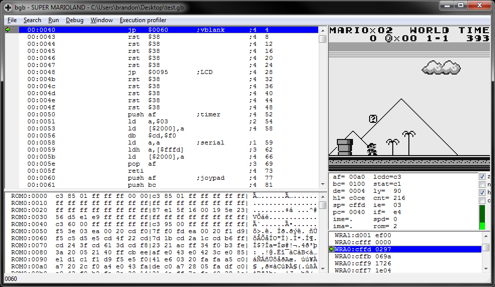

# gbdasm
A Game Boy disassembler that produces [RGBDS](https://github.com/rednex/rgbds) compatible source. Written in .NET Core.

## Usage
```
gbdasm -o rom.asm rom.gb
```

gbdasm's goal is to produce identical ROMs when disassembled and re-assembled:

## Re-assembly
```
rgbasm -h -L -o rom.o rom.asm
rgblink -o test.gb test.o
bgb test.gb
```



## Comparing ROMs
```
certutil -hashfile test.gb
certutil -hashfile rom.gb
```